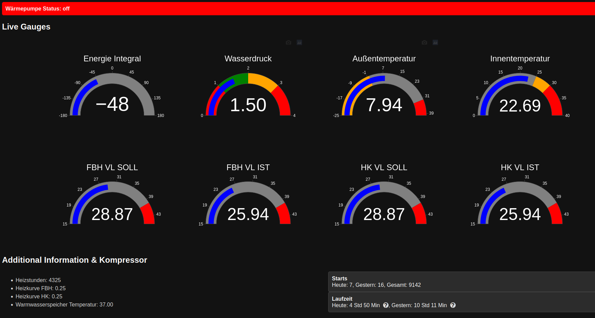

# Vaillant EEBus MQTT Dashboard

Dieses Projekt empfängt EEBus-Daten von Vaillant-Heizsystemen, die über das MQTT-Protokoll gesendet werden. Diese Daten werden verarbeitet und in Echtzeit auf einer lokalen Webseite angezeigt. Die Webseite nutzt interaktive Gauges zur Visualisierung von Systemparametern wie Temperatur, Heizleistung und Energieverbrauch.

## Funktionen

- **EEBus-Daten via MQTT:** Die App empfängt Echtzeitdaten von Vaillant-Geräten über MQTT.
- **Datenverarbeitung:** Verarbeitet die empfangenen EEBus-Daten, um wichtige Parameter wie Temperatur, Heizleistung und Energieverbrauch darzustellen.
- **Echtzeit-Gauges:** Zeigt die wichtigsten Systemdaten in interaktiven Gauges auf einer lokalen Webseite an.
- **Webbasierte Benutzeroberfläche:** Eine Flask-basierte Webseite zeigt die Daten an und wird in Echtzeit aktualisiert.

## Technologie

- **Python:** Für die gesamte Backend-Logik.
- **Flask:** Für die Webanwendung.
- **Paho MQTT Client:** Für die MQTT-Kommunikation.
- **Plotly:** Zur Darstellung interaktiver Gauges.
- **HTML/CSS:** Für das Frontend-Design.

## Installation

### Voraussetzungen

Stelle sicher, dass du die folgenden Programme installiert hast:

- Python 3.x
- pip (Python Paketmanager)

### Schritt 1: Erstelle eine virtuelle Umgebung

Es wird empfohlen, eine virtuelle Umgebung zu verwenden, um die Abhängigkeiten isoliert zu installieren. Navigiere in das Verzeichnis des Projekts und führe folgenden Befehl aus:

```bash
python -m venv venv
```

Dies erstellt eine virtuelle Umgebung im Ordner `venv`.

### Schritt 2: Aktiviere die virtuelle Umgebung

- **Windows:**

```bash
venv\Scripts\activate
```

- **macOS/Linux:**

```bash
source venv/bin/activate
```

### Schritt 3: Installiere die Abhängigkeiten

Nachdem die virtuelle Umgebung aktiviert ist, installiere die erforderlichen Python-Abhängigkeiten:

```bash
pip install -r requirements.txt
```

Die Datei `requirements.txt` enthält alle notwendigen Pakete, z.B.:

```bash
eventlet
paho-mqtt
Flask
Flask-SocketIO
```

### Schritt 4: Konfiguration

Die MQTT-Verbindungsdetails werden in einer Konfigurationsdatei (`config.json`) gespeichert. Wenn diese Datei nicht vorhanden ist, wird die Standardkonfiguration aus `default_config.json` verwendet.

**Beispiel einer `config.json`:**

```json
{
  "mqtt_config": {
    "username": "",
    "password": "",
    "host": "localhost",
    "port": 1883
  },
  "mqtt_values": {
    "ebusd/hmu/EnergyIntegral": {
      "type": "gauge",
      "value": 0,
      "range": [
        -180,
        180
      ],
      "title": "Energie Integral",
      "color_ranges": [
        {
          "range": [
            -180,
            180
          ],
          "color": "gray"
        }
      ],
      "isInteger": "true"
    },
    "ebusd/700/WaterPressure": {
      "type": "gauge",
      "value": 0.0,
      "range": [
        0,
        4
      ],
      "title": "Wasserdruck",
      "color_ranges": [
        {
          "range": [
            0,
            1
          ],
          "color": "red"
        },
        {
          "range": [
            1,
            2
          ],
          "color": "green"
        },
        {
          "range": [
            2,
            3
          ],
          "color": "orange"
        },
        {
          "range": [
            3,
            4
          ],
          "color": "red"
        }
      ],
      "isInteger": "false"
    },
    "ebusd/700/DisplayedOutsideTemp": {
      "type": "gauge",
      "value": 0.0,
      "range": [
        -25,
        40
      ],
      "title": "Außentemperatur",
      "color_ranges": [
        {
          "range": [
            -25,
            0
          ],
          "color": "orange"
        },
        {
          "range": [
            0,
            32
          ],
          "color": "gray"
        },
        {
          "range": [
            32,
            40
          ],
          "color": "red"
        }
      ],
      "isInteger": "false"
    },
    "ebusd/700/Z1RoomTemp": {
      "type": "gauge",
      "value": 0.0,
      "range": [
        0,
        40
      ],
      "title": "Innentemperatur",
      "color_ranges": [
        {
          "range": [
            0,
            25
          ],
          "color": "gray"
        },
        {
          "range": [
            25,
            30
          ],
          "color": "orange"
        },
        {
          "range": [
            30,
            40
          ],
          "color": "red"
        }
      ],
      "isInteger": "false"
    },
    "ebusd/700/Hc1ActualFlowTempDesired": {
      "type": "gauge",
      "value": 0.0,
      "range": [
        15,
        45
      ],
      "title": "FBH VL SOLL",
      "color_ranges": [
        {
          "range": [
            15,
            40
          ],
          "color": "gray"
        },
        {
          "range": [
            40,
            45
          ],
          "color": "red"
        }
      ],
      "isInteger": "false"
    },
    "ebusd/700/Hc1FlowTemp": {
      "type": "gauge",
      "value": 0.0,
      "range": [
        15,
        45
      ],
      "title": "FBH VL IST",
      "color_ranges": [
        {
          "range": [
            15,
            40
          ],
          "color": "gray"
        },
        {
          "range": [
            40,
            45
          ],
          "color": "red"
        }
      ],
      "isInteger": "false"
    },
    "ebusd/700/Hc2ActualFlowTempDesired": {
      "type": "gauge",
      "value": 0.0,
      "range": [
        15,
        45
      ],
      "title": "HK VL SOLL",
      "color_ranges": [
        {
          "range": [
            15,
            40
          ],
          "color": "gray"
        },
        {
          "range": [
            40,
            45
          ],
          "color": "red"
        }
      ],
      "isInteger": "false"
    },
    "ebusd/700/Hc2FlowTemp": {
      "type": "gauge",
      "value": 0.0,
      "range": [
        15,
        45
      ],
      "title": "HK VL IST",
      "color_ranges": [
        {
          "range": [
            15,
            40
          ],
          "color": "gray"
        },
        {
          "range": [
            40,
            45
          ],
          "color": "red"
        }
      ],
      "isInteger": "false"
    },
    "ebusd/hmu/HoursHc": {
      "type": "text",
      "value": "N/A",
      "title": "Heizstunden",
      "data_type": "string"
    },
    "ebusd/700/Hc1HeatCurve": {
      "type": "text",
      "value": "N/A",
      "title": "Heizkurve FBH",
      "data_type": "float"
    },
    "ebusd/700/Hc2HeatCurve": {
      "type": "text",
      "value": "N/A",
      "title": "Heizkurve HK",
      "data_type": "float"
    },
    "ebusd/700/HwcStorageTemp": {
      "type": "text",
      "value": "N/A",
      "title": "Warmwasserspeicher Temperatur",
      "data_type": "float"
    },
    "ebusd/hmu/Status01": {
      "type": "led",
      "value": "off",
      "title": "Wärmepumpe Status"
    }
  }
}
```

### Schritt 5: Anwendung starten

Nachdem du die Abhängigkeiten installiert und die Konfiguration angepasst hast, kannst du die Anwendung starten:

```bash
python main.py
```
Die Webanwendung wird nun auf `http://127.0.0.1:5000` (oder der konfigurierten IP) laufen.
### Empfehlung: Anwendung als Service starten
#### Um die Anwendung dauerhaft im Hintergrund laufen zu lassen, empfiehlt es sich, sie als Systemdienst (z. B. mit systemd unter Linux) zu starten.

## Webinterface

Die Benutzeroberfläche zeigt die wichtigsten Parameter des Vaillant-Systems in Form von interaktiven Gauges an, darunter:

- **Temperaturanzeigen:** Raum-, Rücklauf- und Vorlauftemperatur.
- **Heizleistung:** Aktuelle Heizleistung des Systems.
- **Energieverbrauch:** Der Verbrauch des Systems in Echtzeit.
- **Systemstatus:** Anzeige des aktuellen Betriebsmodus (z.B. Heizmodus, Standby, etc.).

### Echtzeit-Updates

Die Gauges auf der Webseite werden in Echtzeit aktualisiert, um die neuesten MQTT-Daten widerzuspiegeln.

## Erweiterungen

- Integration weiterer IoT-Geräte zur Anzeige und Steuerung.
- Weitere Funktionen zur Steuerung des Vaillant-Systems über die Weboberfläche.
- Historische Daten und Verlaufsgrafiken zur Analyse von Heiz- und Energieverbrauch.

## Lizenz

Dieses Projekt ist unter der MIT-Lizenz lizenziert. Siehe [LICENSE](LICENSE) für Details.

---

**Hinweis:** Dies ist ein Beispiel für die Verwendung von MQTT und EEBus-Daten mit Vaillant-Geräten. Anpassungen an deinem System, Broker oder den Datenparametern sind möglicherweise erforderlich.
